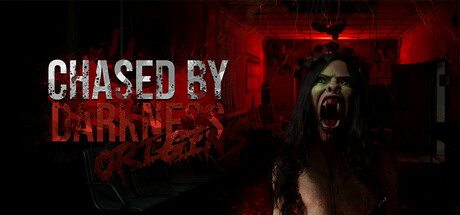
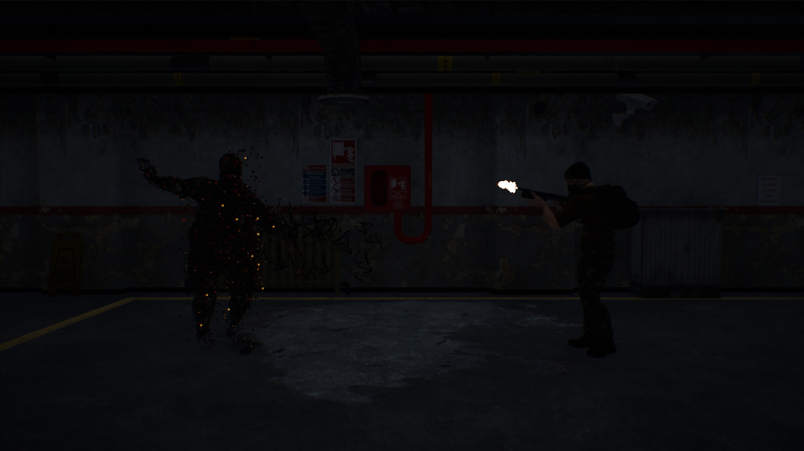
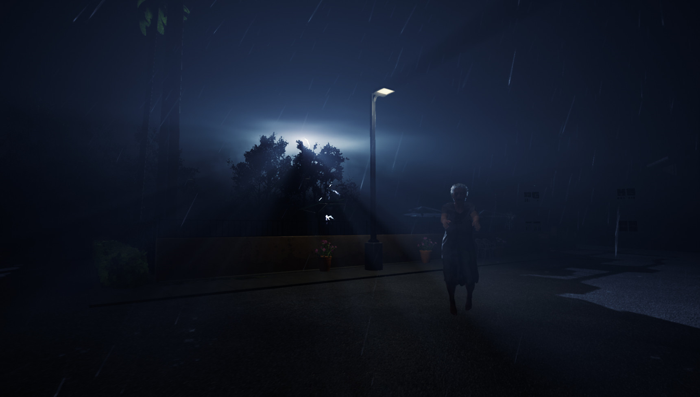
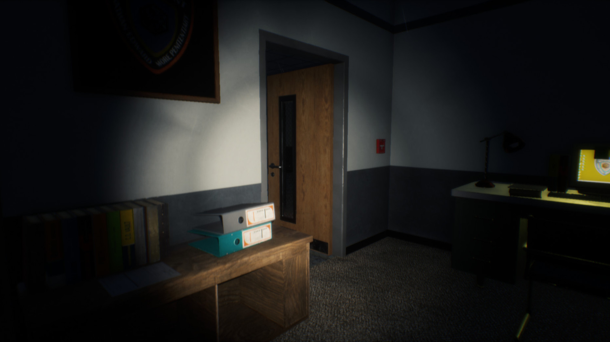

# CHASED BY DARKNESS

> A cooperative horror experience built in Unreal Engine where darkness is never empty.

---

# About The Game

**Chased by Darkness** is a first-person survival horror co-op game focused on atmosphere, tension, and psychological pressure.  
Players must navigate dark environments while being relentlessly hunted by unknown entities lurking in the shadows.

The game was developed collaboratively by a team of 3 developers using **Unreal Engine**, combining **Blueprints** and **C++** systems to create immersive gameplay and dynamic horror sequences.

---

# Gameplay Features

- Dynamic chase sequences
- Atmospheric horror environments
- Immersive sound design
- Psychological tension mechanics
- Exploration-focused gameplay
- Dark ambient storytelling

---

# Screenshots

---

---

---

# Technologies Used

- Unreal Engine 5
- Blueprints
- C++
- Audio Design Tools

---

# Development Team 🇧🇷

Developed by a team of 3 developers.

## My Contributions

As part of the development team, I was mainly responsible for:

- Gameplay design and balancing
- Blueprint scripting support
- Audio system implementation
- Sound design and integration
- Gameplay flow direction
- Horror atmosphere development
- UI/UX gameplay feedback adjustments

I created and integrated the game's audio experience, helping shape the tension, immersion, and pacing throughout gameplay.

---

# Development Process

The project focused heavily on creating fear through environmental storytelling, audio immersion, and player vulnerability rather than relying solely on jumpscares.

A major part of development involved balancing:
- lighting
- sound cues
- enemy pressure
- environmental tension

to maintain constant psychological discomfort during gameplay.

# Technical Highlights

- Assisted in gameplay logic iteration
- Participated in debugging and gameplay testing
- Collaborative development using version control

# Available On

  

  

